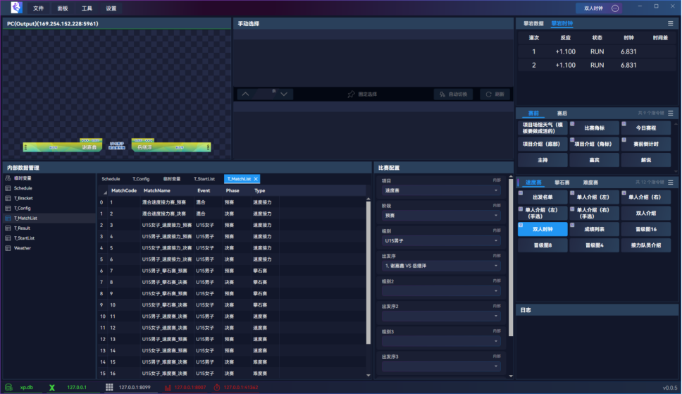
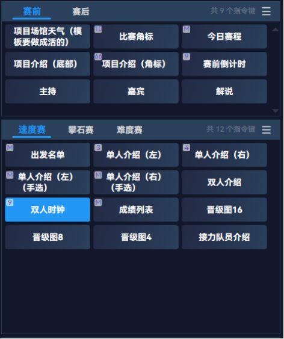
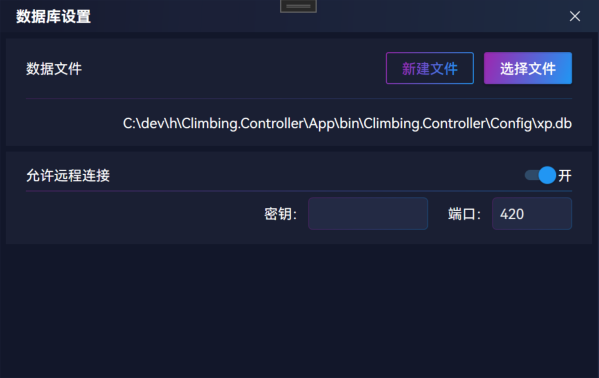
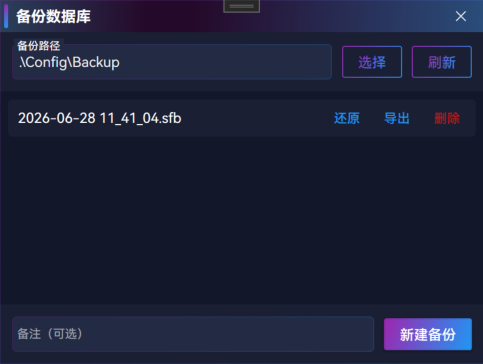
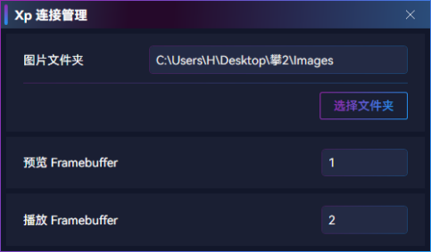
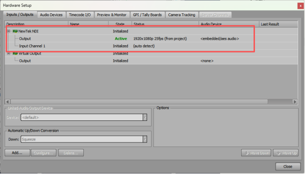
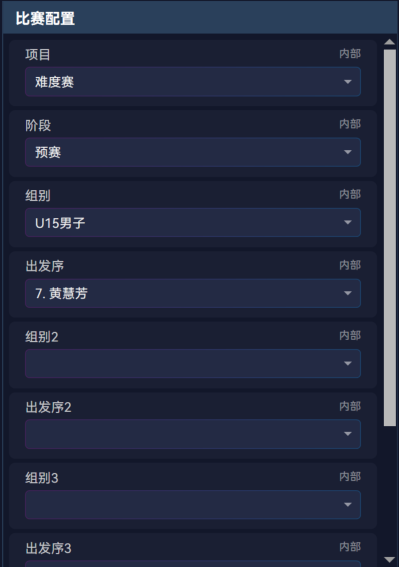
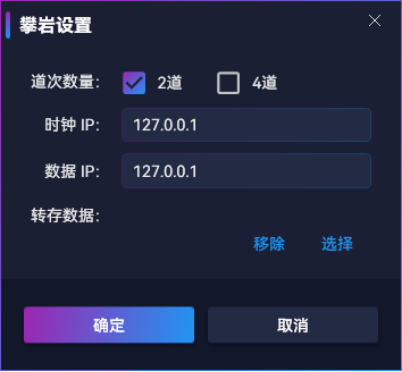

## 注册

电脑插上加密狗会自动注册，注册后程序右下角将不显示 `未注册` 标识。

未注册的程序，仅可进行基础操作，不能对外发起控制。

若使用过程拔掉加密狗，一般在 60s 内会自动改为 `未注册` 状态。

## 播出指令

可控制指令键进行预览、播上、播下、清屏、选择、翻页等

### 指令键播出

- 预览：鼠标点击选中，选中即预览
- 播上：选中后按下 `空格` 或 `F3` 可播出
- 播下：按下 `Q` 或 `F4` 播下（`Q` 键需要保持英文输入法）
- 清屏：按下 `ESC` 键可播下所有指令，紧急情况使用，平时用不到

> 注意当前播出中的指令，为防止数据错误更新，不会有预览。

理论上不按 `空格` 和 `F3` 的情况下，任何操作都不会上屏，可安全操作。

### 手动选择

有些指令需要手动选择或翻页，如`今日赛程`、`单个奖牌`等，在`手动选择`面板可进行选择或翻页。

- 如`单个奖牌`需要根据直播进度，手动选择金、银、铜字幕
- 如`出发名单`需要进行翻多页展现

选择时也会预览，按下 `空格`（或 `F3`）进行播出或翻页更新

`自动切换`可用于多页、固定间隔的情况下使用，很少会用到，手选一般更可控

### 播出记录

播出操作可在 `工具->播出记录` 中进行导出，可用于赛后分析统计

## 编辑指令键

> 文档编写未完成

## 本地数据管理

本地数据用于:

- `内部数据管理` 面板中的表和内容
- `比赛配置` 面板的配置
- 指令键和指令区的配置
- 查询语句
- 等

### 本地数据配置

点击菜单 `文件 -> 本地数据配置` 可打开配置弹窗：

点击 `选择文件` 或 `新建文件` 按钮可切换本地数据，

切换数据后关闭弹窗会更新所有用到内部数据的内容。

打开 `远程连接` 开关后，可允许 navicat 数据库管理工具在局域网远程连接。

### 本地数据备份

点击菜单 `文件 -> 本地数据备份` 可打开配置弹窗：

`备份路径` 用于存储、加载备份文件。

点击 `新建备份` 按钮可进行一次备份，备份的文件可用于还原，

一般进行危险操作前、或做出重大修改后，进行一次备份，确保数据安全。

### 本地数据表的操作

在 `本地数据管理` 面板中，可对内部表进行编辑、查看等操作。

本地数据表用于存放比赛数据、配置信息等，指令键可方便直接读取用于替换模板内容。

> 文档编写未完成

### 临时变量

在 `本地数据管理` 面板中，双击 `临时变量` 表，可打开临时变量。

临时变量主要是为了优化常用数据的读取性能，

在程序和查询语句中，使用临时变量表中的数据占用的资源很低，

一般用于高频查询如 `时钟`、`比分` 等指令键，比赛配置中的常用参数也会用到。

> 文档编写未完成

## 查询语句管理

> 文档编写未完成

## 播控 Ross Xp

### 连接配置

由于 Ross Xp 限制，只能对本机一台设备进行控制。

在程序右下角 X 标识的连接，灰色为未开启连接，红色为已开启连接但未成功，将一直尝试重新连接，绿色为已连接：

在 `工具 -> Xp` 连接管理 中可修改连接配置：

其中图片文件夹用于动态替换图片，如国旗、奖牌、运动员照片等（模板中的固定的图片可不放这里）。

预览/播出 Framebuffer 要与 Ross Xp 中保持一致

### 配置 Xp 预览

需在 Ross Xp 中创建一个 NDI 输出，用于预览。连接管理中的预览 Framebuffer 需与这个输出一致。

在播控中，菜单 `工具 -> NDI 监控管理`，可进行 NDI 预览的配置。当前已配置本机 Xp 预览，无需修改。

### 配置 Xp 播出

Ross Xp 中的真实输出，连接管理中的播出 Framebuffer需与这个输出一致。

### 模板信息同步

在 Ross Xp 中的 `Sequence` 区域，点击 `右键 -> Take Item List -> Export To`，可导出一个 xml 文件。

在播控中，菜单 `文件 -> 导入 Xp 模板 -> 选择文件`，待 Loading 完成后即成功导入模板信息，导入后可进行指令的编辑、数据替换、播出控制。

当模板更新id、字段，或新增模板、删除模板后，需要进行一次模板信息同步，并且编辑指令更新数据的配置。

### 模板复用

同样式的模板建议只做一个，如男子出发名单、女子出发名单、难度出发名单、速度出发名单等，只需做一个出发名单模板即可。

又如单人介绍、嘉宾介绍、裁判介绍等，若样式相同也可只做一个单人介绍模板。

数据替换完全由播控进行。

### 字段发布

在 Xp 的Layout 中，需要动态替换的文字、图片，需要打开发布“Public Object”。

文本需要同时勾选“Text”，图片（Quad）需要同时勾选“Material”。

在 Xp的Sequence中，Template Data 一律设为Static（默认选择，新模板可无视），否则播控无法替换。

### 播出层

播出层只能大于或等于0，不能小于0。建议 0-9，当然 10 以上也可。

常规大版可统一0层或1层，常挂模板如时钟、实时成绩等用其他层，不同层可同时播出。

### 性能提升

时钟这种字幕频率很高，且获取很轻便，

实时成绩更新频率低，且相对查询耗时。

这两类字幕应该拆为两个模板制作，不能做到一起，

播控指令也分成两个播出，否则实时成绩查询慢会拖累时钟的更新。

## 播控 vMix

文档编写未完成

## 比赛管理

### 赛前确认

赛前需确认有哪些比赛，和计时核对每场比赛的名称。

在`内部数据管理`面板，双击打开表 `T_MatchList`，可进行比赛编辑。

其中MatchCode 用于数据关联标识，自定义值但不能有重复的。

Event 是组别，一般值如`男子`、`U15男子`、`女子`、`混合`等。

Phase 是阶段，值为`预赛`、`决赛`。

Type 是比赛类型，值为`攀石赛`、`速度赛`、`速度接力`等。

在赛前需保证这张表内容准确完整，否则数据处理会有问题。

### 比赛配置

在“比赛配置”面板中，需选择当前比赛的项目、阶段、组别、出发序。

攀石和难度这种多组同时比的，根据同时比的组别数量，可以选择组别2、出发序2等，选择后可播出对应的指令。

接收时钟的端口，会根据当前选中的比赛类型自动切换。

### 修改比赛配置

在`比赛配置`面板中，右键点击可进行编辑、新增、删除。

暂时用不到这个。

## 接收数据设置

在菜单 `设置 -> 攀岩设置` 弹窗中，可设置接收数据：

根据实际情况选择道次数量（这个会决定速度赛用 41362还是41363端口）。

设置 `转存数据` 后，收到的时钟、成绩等信息会写入 xml，这个现在已经用不到了。

在下方连接状态区域，可看到当前接收数据、时钟实际使用的 ip 和端口：

